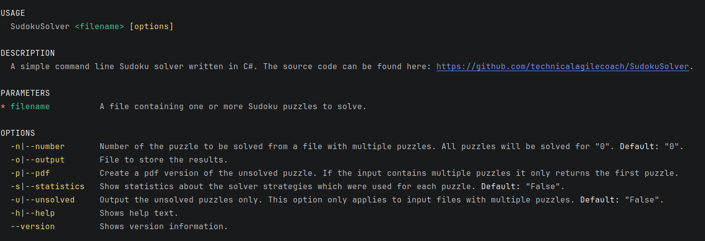

# Sudoku Solver

A command line Sudoku solver written in C#.

[The project als contains a vibe coded UI which allows to replay the steps performed by the solver. This can be run when SudokuSolver.GUI is used as the starting project.]

The solver implements several solution strategies described by Andrew Stuart at https://www.sudokuwiki.org/Sudoku.htm.

It is capable of solving Sudoku puzzles of average difficulty, this should be sufficient for most puzzles you encounter in newspapers. 

Currently it can solve all [50 puzzles](https://projecteuler.info/resources/documents/0096_sudoku.txt) from [Project Euler - Problem 96 Su Doku](https://projecteuler.net/problem=96).

## Usage

